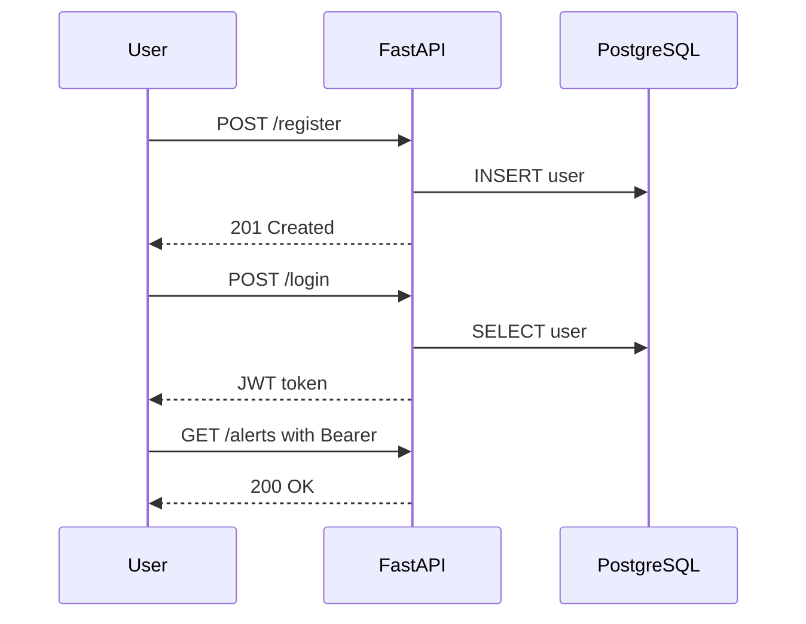

# 🔐 Authentication Flow

## JWT Lifecycle

```mermaid
sequenceDiagram
    participant U as User
    participant API as FastAPI
    participant DB as PostgreSQL
    U->>API: POST /register
    API->>DB: INSERT user
    API-->>U: 201 Created
    U->>API: POST /login
    API->>DB: SELECT user
    API-->>U: JWT token
    U->>API: GET /alerts with Bearer
    API-->>U: 200 OK
```

## RBAC Roles

| Role | Permissions |
| :--- | :--- |
| admin | full CRUD |
| analyst | read + update |
| viewer | read-only |
