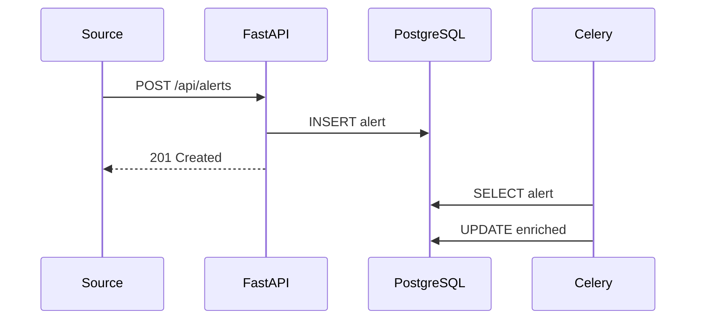

# 🔄 Data Flow

## Alert Lifecycle

## Storage Strategy

| Data | Storage | Retention |
| :--- | :--- | :--- |
| Alerts | PostgreSQL | 90 days |
| Raw JSON | JSONB | 30 days |
| Task cache | Redis | 1 hour |
| Tokens | JWT | 30 min |
