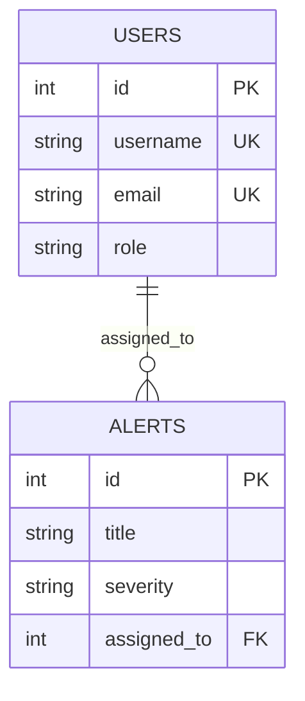

# 🗄️ Database Schema

## ER Diagram

## Indexes

| Table | Column | Type |
| :--- | :--- | :--- |
| users | username | UNIQUE |
| users | email | UNIQUE |
| alerts | status | B-tree |
| alerts | severity | B-tree |
| alerts | created_at | DESC |
