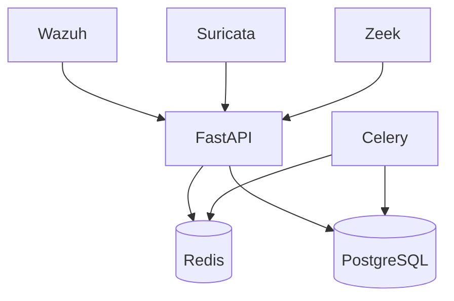

# 🏛️ Architecture Overview

## High-Level Diagram

## Layers

| Layer | Responsibility | Tech |
| :--- | :--- | :--- |
| Ingestion | Receive alerts | FastAPI |
| Processing | Async analysis | Celery + Redis |
| Storage | Persistence | PostgreSQL |
| API | REST + JWT | FastAPI |
