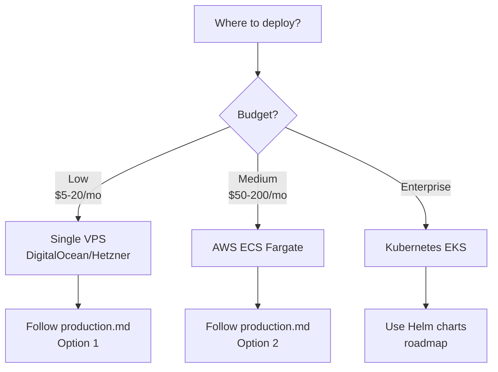

# 📦 Deployment Documentation

Complete guides for deploying SentinelAI in various environments.

## Guides

| Guide | Description | When to use |
| :--- | :--- | :--- |
| [Local Setup](local-setup.md) | Docker-based local development | First-time setup |
| [Production](production.md) | VPS / AWS deployment | Going live |
| [Architecture](../architecture/overview.md) | System design | Understanding the code |

## Deployment Decision Tree

## Environment Matrix

| Env | Compose files | Secrets | Data |
| :--- | :--- | :--- | :--- |
| Local dev | `docker-compose.yml` | `.env` | Local volumes |
| Local prod | `docker-compose.yml` + `docker-compose.prod.yml` | `.env.prod` | Named volumes |
| Cloud | Kubernetes / ECS | Secrets Manager | Managed services |
